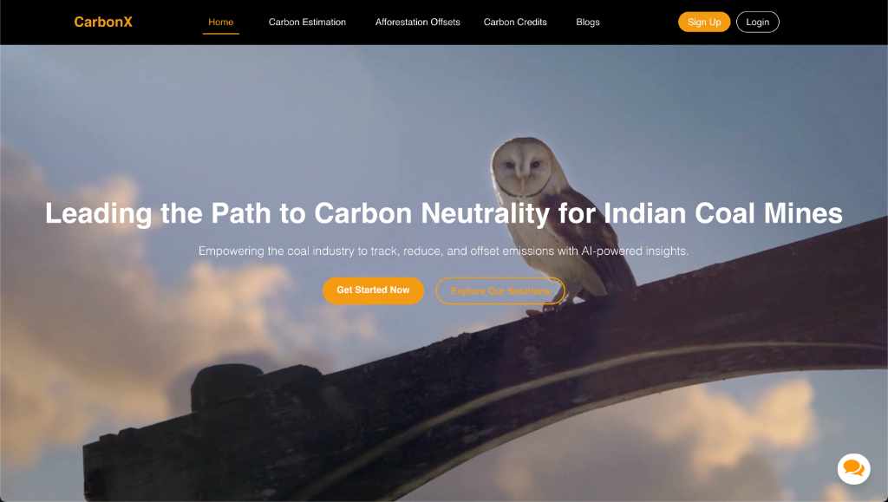
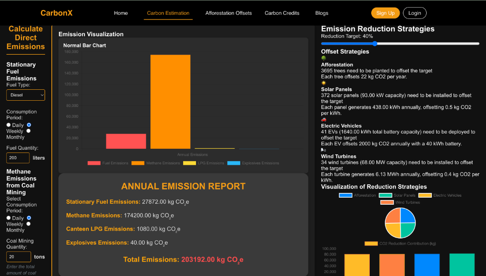
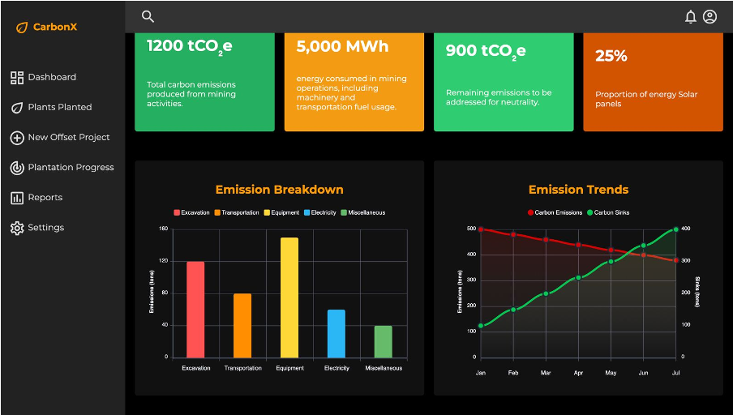
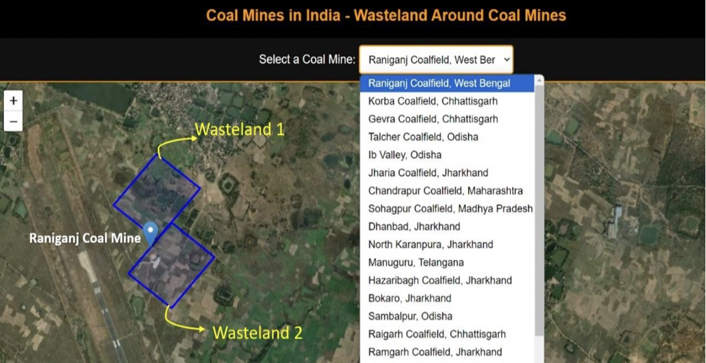

# CarbonX

**Leading the Path to Carbon Neutrality for Indian Coal Mines**

> [!NOTE]
> **Finalist Project - Smart India Hackathon 2024**
> Solving the problem statement: *Carbon Neutrality Pathways for Indian Coal Mines*

## Background
India faces a complex challenge in balancing its reliance on coal for energy with its climate change commitments. Coal mining is a major source of carbon emissions, a greenhouse gas contributing to global warming. To achieve carbon neutrality, the Indian coal sector needs to offset its emissions. This can be done through a combination of strategies like reducing emissions from mining activities, adopting cleaner technologies, and offsetting remaining emissions by planting trees that absorb carbon dioxide.

**CarbonX** is a web-based application designed to be a powerful tool in this journey by helping quantify a mine's carbon footprint and evaluate potential pathways to carbon neutrality.

## Description
The web-based application focuses on the following primary objectives:
- **Activity-wise Quantification**: Precise measurement of carbon emissions across various coal mining activities.
- **Carbon Sink Estimation**: Assessing existing carbon sinks to understand current offset capabilities.
- **Gap Analysis**: Identifying the gap between carbon emissions and sinks to suggest effective pathways for neutrality.

## Comprehensive Solution

### 1. Emission Estimation
The app allows users to input data on various mining activities (e.g., excavation, transportation, equipment usage) to estimate associated carbon emissions based on established emission factors.
- **Per Capita Emission**: Calculates and tracks the per capita emissions of a mine.

### 2. Carbon Neutrality Pathways
CarbonX simulates different emission reduction strategies to guide decision-making:
- **Clean Technologies**: Assessing the impact of adopting electric vehicles (EVs), methane capture systems, and renewable energy sources.
- **Afforestation Offsets**: Calculating the land required for tree plantations to offset remaining emissions, based on state-specific afforestation plans and reduction targets.
- **Other Renewables**: Exploring alternative energy sources to reduce direct electricity consumption.

### 3. Carbon Credits
- **Estimation**: Calculates potential carbon credits earned based on present market rates, incentivizing sustainable practices.

### 4. Data Visualization
- The app presents results visually using interactive charts and graphs to track emission trends and evaluate the effectiveness of implemented strategies.

### 5. Scalability
- Designed to accommodate different mine sizes and types, including both underground and open-cast mines.

## Benefits
- **Transparency**: Provides a clear and verifiable picture of a mine's carbon footprint.
- **Decision Support**: Empowers mine operators to make informed choices for emission reduction.
- **Cost Savings**: Identifies opportunities to optimize operations, potentially reducing costs associated with emissions.
- **Sustainability Goals**: Aids Indian coal mines in their journey towards carbon neutrality, supporting the country's overall climate goals.

## Project Gallery

### GIS wasteland detection

